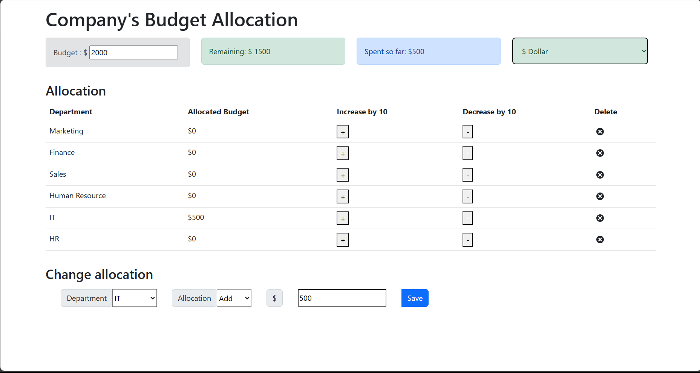
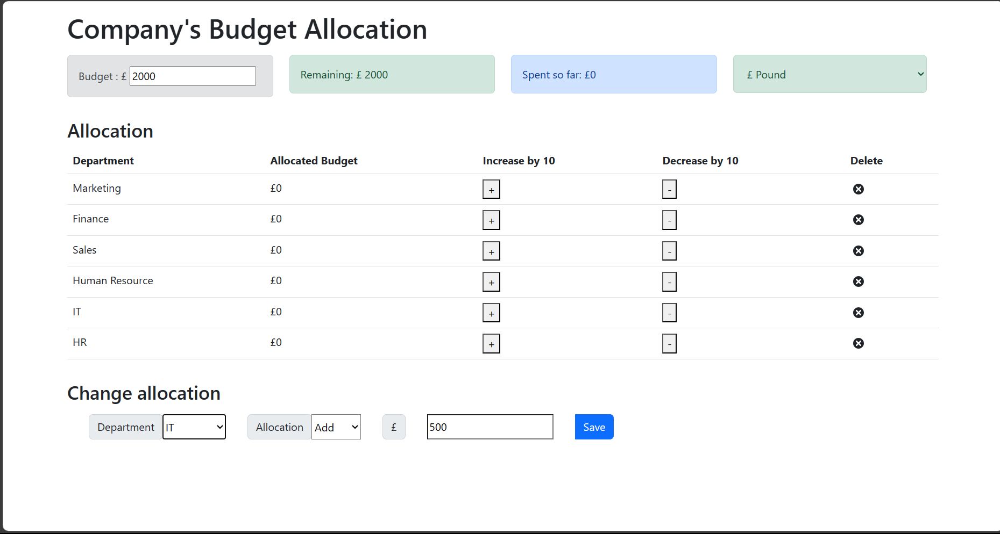
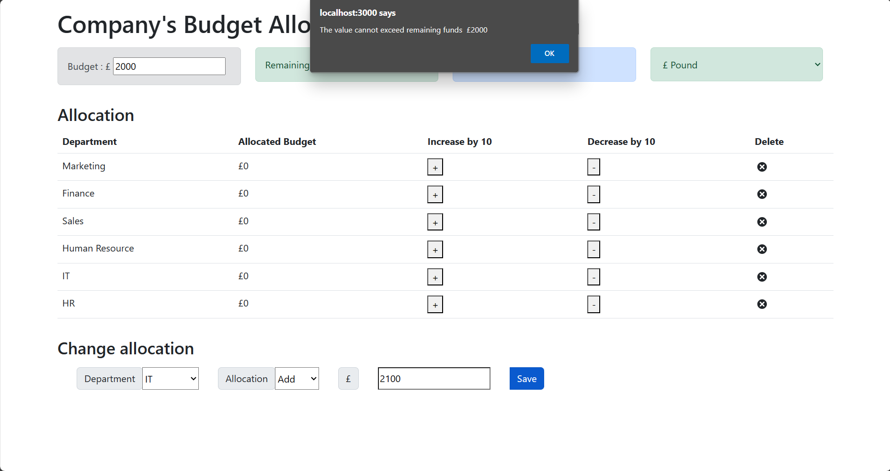
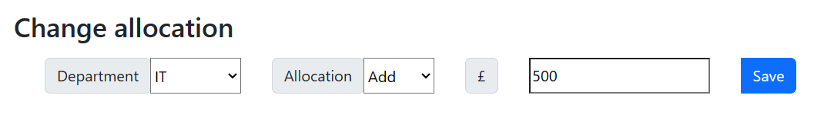
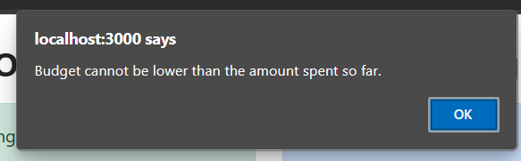
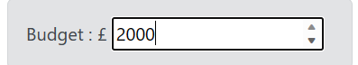
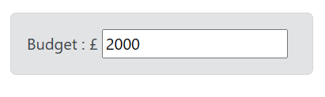
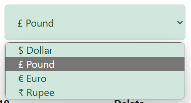
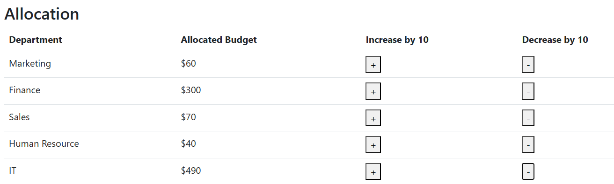
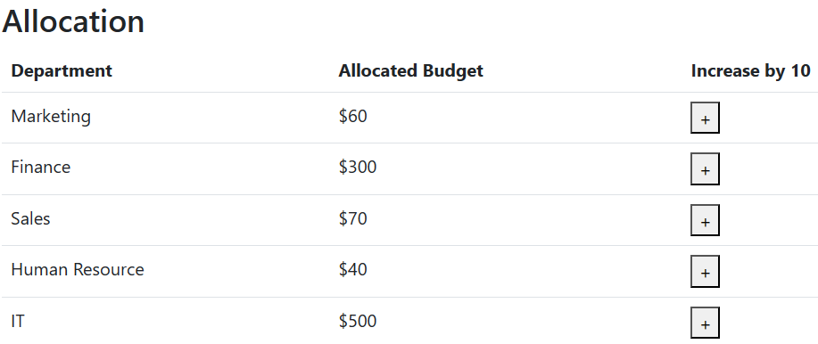

# Budget Tracking Application

Welcome to the Budget Tracking Application! This React-based web application allows you to efficiently manage budget allocations for different departments or categories. It comes with several features and validations to ensure precise budget management.

## Features

### 1. Budget Allocation Validation

- **1.1 Accepts Only Numbers in the Allocation Field**
  - The application accepts only numerical values in the allocation field, ensuring accurate input.
  
- **1.2 Allocation Does Not Exceed Remaining Budget**
  - The application prevents allocations that exceed the remaining budget, ensuring responsible budget management.

### 2. Editable Budget Value

- **2.1 Editable Budget Field with Increment and Decrement by 10**
  - You can easily edit the budget field by increasing or decreasing the value in increments of 10.
  
- **2.2 Prevents Amount Lower Than Amount Spent So Far**
  - The application restricts setting a budget lower than the amount spent so far to maintain accurate financial records.
  
- **2.3 Upper Limit Set to 20,000**
  - The upper limit for the budget value is set to 20,000, allowing for flexibility in budget management.

### 3. Dropdown to Change Currency

- **3.1 Currency Label and Editable Dropdown**
  - The currency label is appropriately placed, and the dropdown is editable, allowing you to choose from four currency options: Dollar, Euro, Pound, Ruppee in a stylized dropdown list format.
  
- **3.2 Editable Currency Dropdown List with Four Values**
  - The dropdown list includes four currency values in the specified format.
  
- **3.3 Stylized Dropdown List**
  - The dropdown list is stylized for an enhanced user experience.

### 4. Currency Prefix

- **4.1 Currency Prefix Added to Change Allocation Textbox (1 pt)**
  - A currency prefix is added to the change allocation textbox for clarity and convenience.
  
- **4.2 Currency Prefix Added to Budget Value Textbox (1 pt)**
  - A currency prefix is also added to the budget value textbox.

### 5. Currency Dropdown Change Event

- **5.1 Currency Representation Changes on Dropdown Selection**
  - **Budget**
  - **Remaining**
  - **Spent So Far**
  - **Allocated Budget**
  - **Change Allocation**
  - Upon changing the currency dropdown value, all currency representations on the screen are updated accordingly.

### 6. Decrease and Increase Buttons

- **6.1 Decrease Button for All Departments with Increment and Decrement by 10**
  - Each department has a decrease button alongside the increase button, allowing for easy adjustments in allocation.
  
- **6.2 OnClick Functionality for Decrease Button**
  - Clicking the decrease button reduces the allocation value by 10.
  
- **6.3 Stylish + Button**
  - The + button is stylized with the provided image, enhancing the overall user experience.
  
- **6.4 Stylish - Button**
  - The - button is also stylized with the provided image for a cohesive design.
 
### 7. Screenshots

**Screenshots of the web app**
- 
- 
- 
- 
- 
- 
- 
- 
- 
- 
